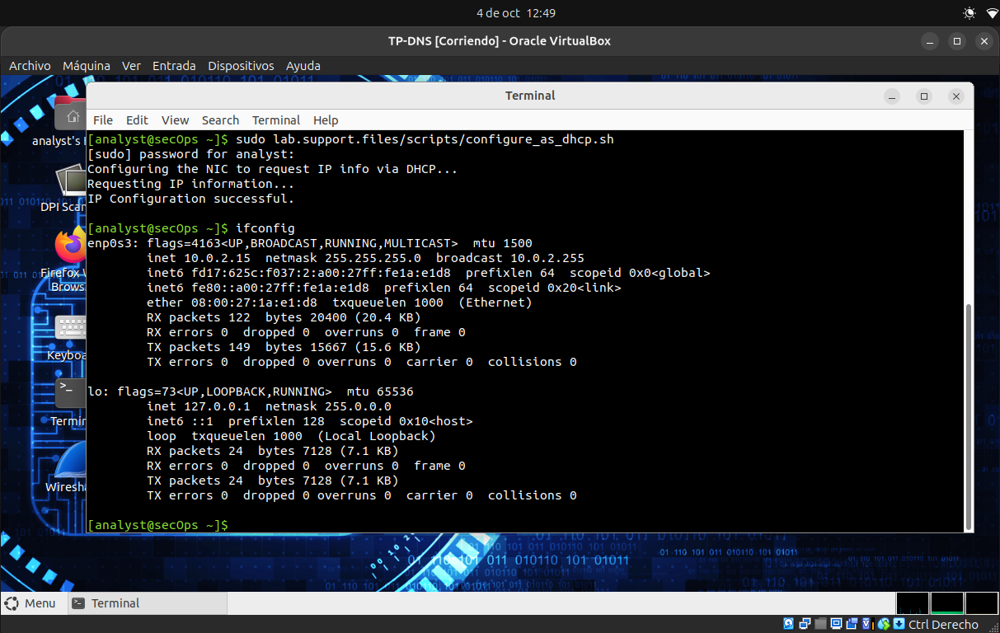
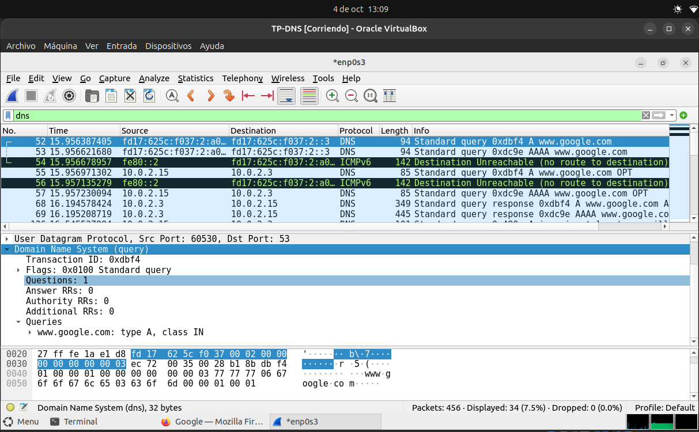
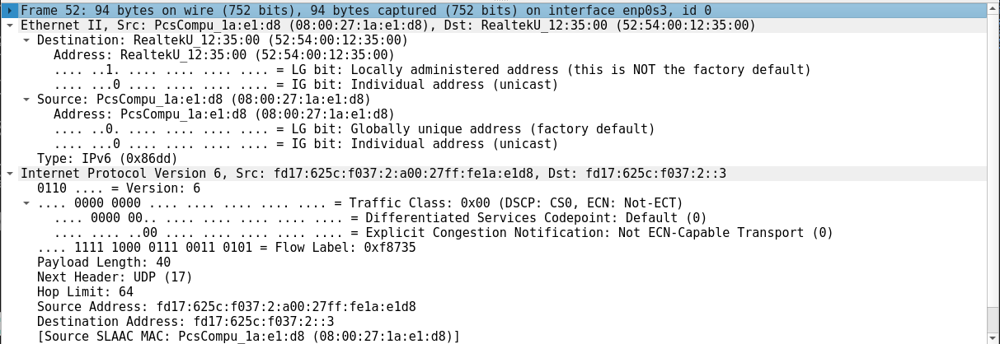
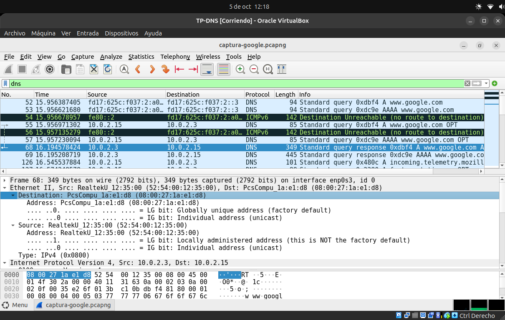
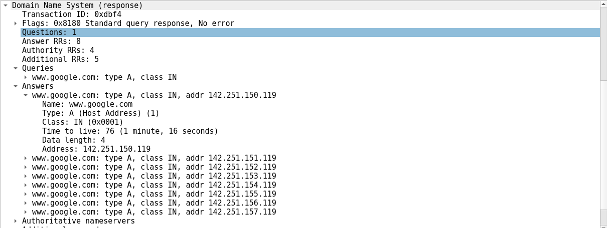

# 10.2.7 Lab - Using Wireshark to Examine a UDP DNS Capture

## Parte 1: Registrar la información sobre la configuración IP de la VM

#### Información de la interfaz de red

```bash
sudo lab.support.files/scripts/configure_as_dhcp.sh
ifconfig
```


#### Servidor DNS

```bash
cat /etc/resolv.conf
```


#### Tabla de enrutamiento

```bash
netstat -rn
```


### Configuración de red

| Descripción                                 | Configuración |
| :------------------------------------------ | :------------ |
| **Dirección IPv4**                          | 10.0.2.15 |
| **Dirección IPv6**                          | fd17:625c:f037:2:a00:27ff:fe1a:e1d8 |
| **Dirección MAC**                           | 08:00:27:1a:e1:d8  |
| **Dirección IP del gateway predeterminado** | 10.0.2.2           |
| **Dirección IP del servidor DNS**           | 127.0.0.53         |

---

## Parte 2: Utilizar Wireshark para capturar consultas y respuestas DNS

### Configuración de la captura

Se inició Wireshark y se comenzó la captura de paquetes. Luego se accedió a `www.google.com` y una vez cargada la página, se detuvo la captura:


---

## Parte 3: Analizar los paquetes capturados de DNS/UDP

### Paso 1: Filtrar los paquetes DNS



---

### Paso 2: Examinar los campos de un paquete de consulta DNS

#### Direcciones IP y MAC



#### Información del paquete

| Descripción                  | Resultados del Wireshark              |
| :--------------------------- | :------------------------------------ |
| **Tamaño de la trama**       | `94 bytes`                            |
| **Dirección MAC de origen**  | `08:00:27:1a:e1:d8`                   |
| **Dirección MAC de destino** | `52:54:00:12:35:00`                   |
| **Dirección IP de origen**   | `fd17:625c:f037:2:a00:27ff:fe1a:e1d8` |
| **Dirección IP de destino**  | `fd17:625c:f037:2::3`                 |
| **Puerto de origen**         | `60530`                               |
| **Puerto de destino**        | `53`                                  |


> ¿Es la dirección MAC de origen la misma que la registrada en la Parte 1 para la VM? 

> ¿Es la dirección IP de origen la misma que la dirección IP de la PC local que registró en la parte 1?

Si, de origen son las misma direcciones IP y MAC que en la parte 1.

> ¿Es la dirección IP de destino la misma que la puerta de enlace predeterminada (gateway) que observó en la parte 1?

No, la dirección IP de destino es de la consulta al servidor DNS, no es la misma del gateway.

---

### Paso 3: Examinar los campos de un paquete de respuesta DNS



> ¿Qué dispositivo es la dirección MAC de origen y qué dispositivo es la dirección MAC de destino?

La dirección MAC de origen corresponde al servidor DNS y la dirección MAC de destino es la VM.

> ¿Qué sucedió con los roles de origen y destino correspondientes a la VM y al gateway predeterminado?

Los roles se invirtieron respecto de la consulta DNS. En la consulta, la VM era el origen y el servidor DNS el destino. En la respuesta, el servidor DNS pasa a ser el origen y la VM pasa a ser el destino.


> Segmento UDP

El servidor DNS utiliza el puerto 53 como puerto de origen al enviar la respuesta y la VM utiliza el puerto 57967 como puerto de destino para recibir la respuesta.

> Direcciones IP resueltas

El servidor DNS encontro 8 direcciones IPv4 para el dominio `www.google.com`



#### Información del paquete

| Descripción                  | Resultado           |
| :--------------------------- | :------------------ |
| **Número de trama**          | `68`                |
| **Tamaño de la trama**       | `349 bytes`         |
| **Dirección MAC de origen**  | `52:54:00:12:35:00` |
| **Dirección MAC de destino** | `08:00:27:1a:e1:d8` |
| **Dirección IP de origen**   | `10.0.2.3`          |
| **Dirección IP de destino**  | `10.0.2.15`         |
| **Puerto de origen**         | `53`                |
| **Puerto de destino**        | `57967`             |

---

## Pregunta de reflexión

#### ¿Cuáles son los beneficios de utilizar UDP en lugar de TCP como protocolo de transporte para DNS?

Utilizar UDP no requiere establecer una conexión como en TCP, permitiendo que las consultas DNS se realicen de forma rápida y eficiente. 
También UDP tiene una menor sobrecarga que TCP, el encabezado UDP ocupa 8 bytes frente a los 20 bytes mínimos de TCP reduciendo el consumo de ancho de banda.
