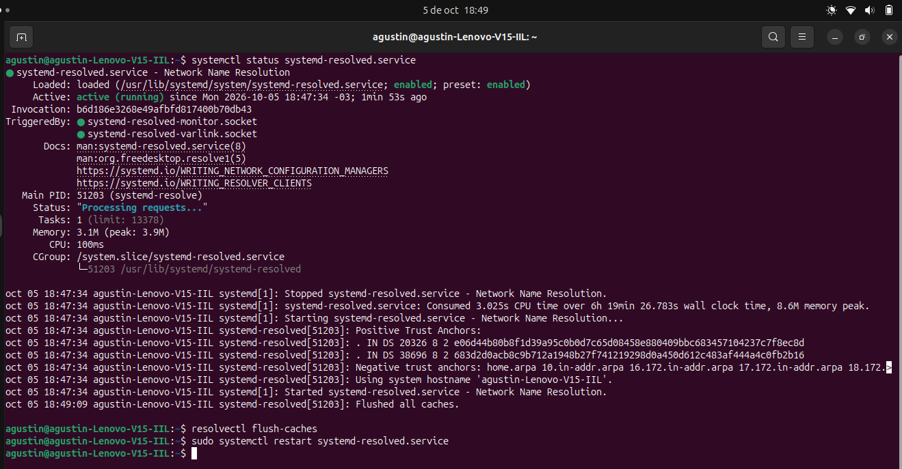
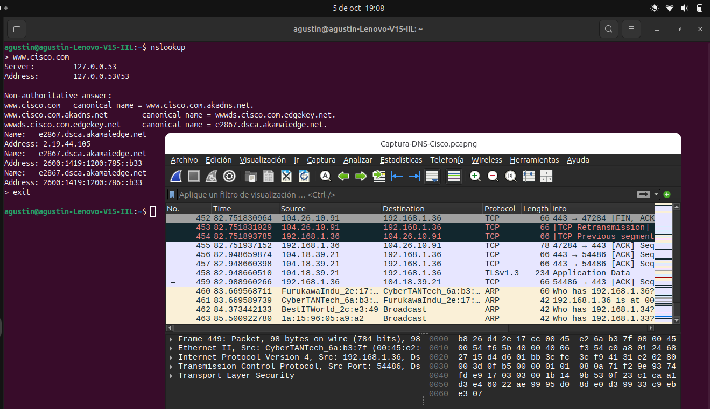
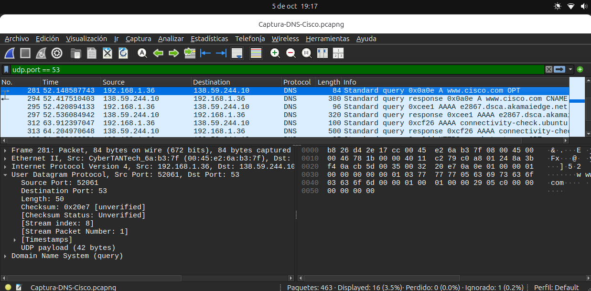
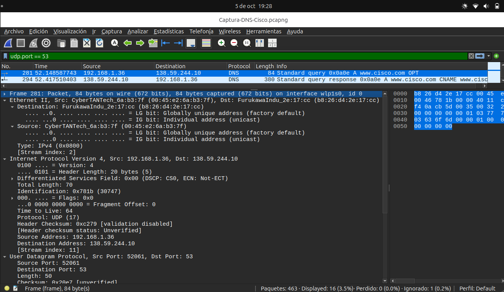

# 17.1.7 Lab - Exploring DNS Traffic

## Parte 1: Capturar tráfico DNS

### Paso 1: Descargar e instalar Wireshark

Una vez instalado tuve que configurarlo, porque al abrirlo no veía mi interfaz de Wi-Fi. Lo solucione ejecutando los siguientes comandos:

```bash
sudo dpkg-reconfigure wireshark-common
```
Permite capturar tráfico sin ser root (abre una interfaz donde te pregunta si quieres dar permisos de captura a usuarios estándar).

```bash
sudo usermod -aG wireshark $USER
```
Ese comando agrega tu usuario actual al grupo de sistema llamado wireshark.

```bash
newgrp wireshark
```
Actualiza los permisos de tu terminal activa, para no tener que reiniciar la computadora.

```bash
groups
wireshark &
```
Compruebo que wireshark este en el listado y lo ejecuto.

Y para ver cual mi interfaz de Wi-Fi:
```bash
ip address
```
La cual debe aparecer al abrir wireshark.

---

### Paso 2: Capturar tráfico DNS

Para limpiar el cache utilizo:

```bash
resolvectl flush-caches
sudo systemctl restart systemd-resolved.service
```


Luego:

```bash
nslookup
> www.cisco.com
```



---

## Parte 2: Explorar tráfico de consultas DNS

### Consulta DNS

Se aplicó el filtro `udp.port == 53` y selecciono a Standard query ... www.cisco.com



### Ethernet II

> ¿Qué sucedió con las direcciones MAC de origen y de destino? ¿Con qué interfaces de red están asociadas estas direcciones MAC?

La dirección MAC de origen es `00:45:e2:6a:b3:7f`, corresponde a la interfaz Wi-Fi `wlp1s0` de la computadora, la dirección MAC de destino es `b8:26:d4:2e:17:cc`, corresponde al gateway.

### Direcciones IP

> ¿Cuáles son las direcciones IP de origen y destino? ¿Con qué interfaces de red están asociadas estas direcciones IP?

La dirección IP de origen es `192.168.1.36`, corresponde a `wlp1s0`, y la dirección IP de destino es `138.59.244.10`, corresponde al servidor DNS que resuelve la consulta.

### Puertos UDP

> ¿Cuáles son los puertos de origen y de destino? ¿Cuál es el número de puerto de DNS predeterminado?

El puerto de origen es `52061` y el puerto de destino es `53`, el cual corresponde al puerto predeterminado de DNS. 




### Direcciones IP y MAC de la computadora

```bash
ip address
```

o:

```bash
ifconfig
```

**Resultado:**

[Explicar si las direcciones coinciden y qué dispositivo corresponde a cada una.]

### Consulta DNS y Flags

La consulta corresponde al dominio:

```text
[DOMINIO]
```

**Tipo de consulta:**

```text
[ A / AAAA / CNAME / OTRO ]
```

**Transaction ID:**

```text
[ID]
```

**Recursion Desired:**

```text
[YES / NO]
```

**Cantidad de preguntas:**

```text
[Questions]
```

**Cantidad de respuestas:**

```text
[Answer RRs]
```

**Evidencia:**

> Insertar captura de Domain Name System (query), mostrando Flags y Queries.

---

## Parte 3: Explorar tráfico de respuestas DNS

### Respuesta DNS

Se seleccionó el paquete correspondiente a la respuesta:

```text
[Standard query response ...]
```

### Direcciones MAC

**MAC de origen:**

```text
[MAC ORIGEN]
```

**MAC de destino:**

```text
[MAC DESTINO]
```

### Direcciones IP

**IP de origen:**

```text
[IP ORIGEN]
```

**IP de destino:**

```text
[IP DESTINO]
```

### Puertos UDP

**Puerto de origen:**

```text
[PUERTO ORIGEN]
```

**Puerto de destino:**

```text
[PUERTO DESTINO]
```

### Comparación con la consulta DNS

[Indicar qué direcciones y puertos se mantienen y cuáles se invierten respecto del paquete de consulta.]

### Flags de la respuesta

**Recursion Desired:**

```text
[YES / NO]
```

**Recursion Available:**

```text
[YES / NO]
```

**Authoritative:**

```text
[YES / NO]
```

**Reply Code:**

```text
[NO ERROR / OTRO]
```

### Registros de la sección Answers

| Dominio   | Tipo      | Información |
| --------- | --------- | ----------- |
| [DOMINIO] | [CNAME/A] | [VALOR]     |
| [DOMINIO] | [CNAME/A] | [VALOR]     |
| [DOMINIO] | [CNAME/A] | [VALOR]     |

### Consultas DNS y `nslookup`

Se compararon los resultados obtenidos mediante Wireshark con los obtenidos utilizando:

```bash
nslookup [DOMINIO]
```

**Similitudes:**

[Indicar qué información coincide.]

**Diferencias:**

[Indicar qué información adicional muestra Wireshark o qué diferencias se observan.]

---

# Reflexión

### 1. A partir de los resultados de Wireshark, ¿qué más podemos averiguar sobre la red si quitamos el filtro?

[Respuesta]

### 2. ¿De qué manera un atacante puede utilizar Wireshark para poner en riesgo la seguridad de sus redes?

[Respuesta]

---

# Conclusión

[Breve conclusión sobre lo aprendido durante la captura y análisis del tráfico DNS.]
