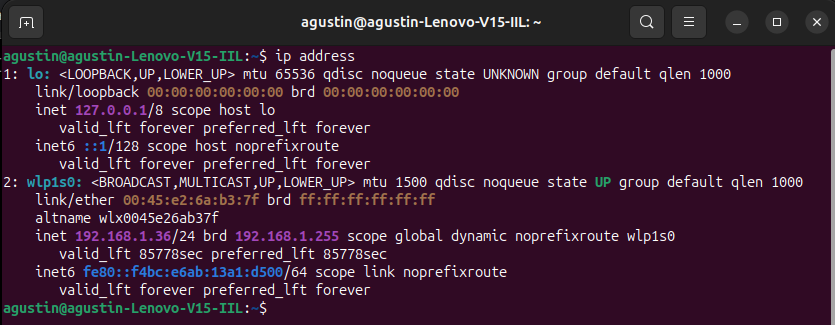
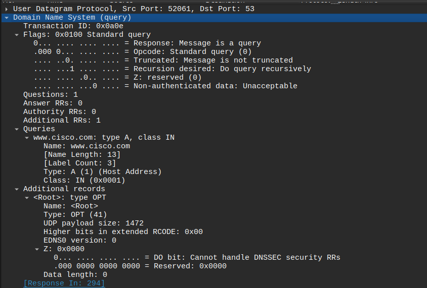
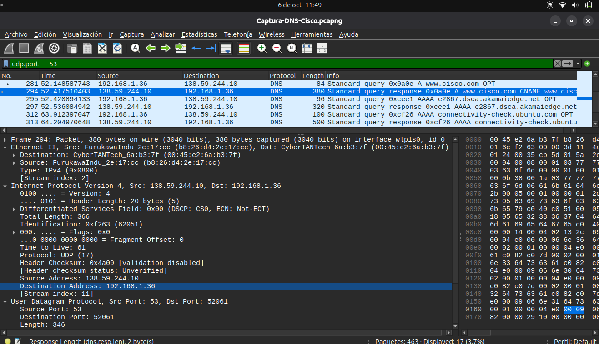
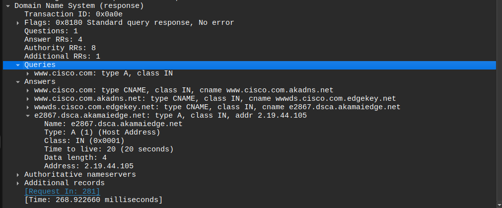

# 17.1.7 Lab - Exploring DNS Traffic

## Parte 1: Capturar tráfico DNS

### Paso 1: Descargar e instalar Wireshark

Una vez instalado tuve que configurarlo, porque al abrirlo no veía mi interfaz de Wi-Fi. Lo solucione ejecutando los siguientes comandos:

```bash
sudo dpkg-reconfigure wireshark-common
```
Permite capturar tráfico sin ser root (abre una interfaz donde te pregunta si quieres dar permisos de captura a usuarios estándar).

```bash
sudo usermod -aG wireshark $USER
```
Ese comando agrega tu usuario actual al grupo de sistema llamado wireshark.

```bash
newgrp wireshark
```
Actualiza los permisos de tu terminal activa, para no tener que reiniciar la computadora.

```bash
groups
wireshark &
```
Compruebo que wireshark este en el listado y lo ejecuto.

Y para ver cual mi interfaz de Wi-Fi:
```bash
ip address
```
La cual debe aparecer al abrir wireshark.

---

### Paso 2: Capturar tráfico DNS

Para limpiar el cache utilizo:

```bash
resolvectl flush-caches
sudo systemctl restart systemd-resolved.service
```


Luego:

```bash
nslookup
> www.cisco.com
```


---

## Parte 2: Explorar tráfico de consultas DNS

### Consulta DNS

Aplicó el filtro `udp.port == 53` y selecciono a Standard query ... www.cisco.com


### Ethernet II

> ¿Qué sucedió con las direcciones MAC de origen y de destino? ¿Con qué interfaces de red están asociadas estas direcciones MAC?

La dirección MAC de origen es `00:45:e2:6a:b3:7f`, corresponde a la interfaz Wi-Fi `wlp1s0` de la computadora, la dirección MAC de destino es `b8:26:d4:2e:17:cc`, corresponde al gateway.

### Direcciones IP

> ¿Cuáles son las direcciones IP de origen y destino? ¿Con qué interfaces de red están asociadas estas direcciones IP?

La dirección IP de origen es `192.168.1.36`, corresponde a `wlp1s0`, y la dirección IP de destino es `138.59.244.10`, corresponde al servidor DNS que resuelve la consulta.

### Puertos UDP

> ¿Cuáles son los puertos de origen y de destino? ¿Cuál es el número de puerto de DNS predeterminado?

El puerto de origen es `52061` y el puerto de destino es `53`, el cual corresponde al puerto predeterminado de DNS. 


### Direcciones IP y MAC de la computadora

> Compare las direcciones MAC y las direcciones IP presentes en los resultados de Wireshark con los resultados obtenidos del símbolo del sistema o terminal. ¿Cuál es su opinión?



La IP de mi computadora es `192.168.1.36` y su MAC es `00:45:e2:6a:b3:7f`, ambas asociadas a `wlp1s0`.
Al comparar los valores coinciden con los de Wireshark. Por lo tanto el paquete fue generado por mi computadora y transmitido a través de `wlp1s0`.

### Consulta DNS y Flags

> Expanda Domain Name System (query) en el panel de Detalles del paquete. Luego, expanda Flags y Queries.



> Observe los resultados. El flag está definido para realizar la consulta (query) recursivamente y así consultar la dirección IP en www.cisco.com.

En los flags se observa `Recursion desired: Do query recursively`, lo que indica que el cliente solicita al servidor DNS que realice la consulta de forma recursiva.

> Aclaración: Una consulta DNS recursiva significa que el servidor DNS, si no conoce la respuesta en su caché, se encarga de buscarla consultando a otros servidores DNS.

---

## Parte 3: Explorar tráfico de respuestas DNS


### Respuesta DNS



> ¿Cuáles son las direcciones MAC e IP de origen y destino y los números de puerto de "Src" (origen) y "Dst" (destino)? ¿Que similitudes y diferencias tienen con las direcciones presentes en los paquetes de consultas DNS?

En el paquete de respuesta DNS, la MAC de origen es `b8:26:d4:2e:17:cc` y la MAC de destino es `00:45:e2:6a:b3:7f`. La IP de origen es `138.59.244.10` y la IP de destino es `192.168.1.36`.

Para los puertos UDP, el puerto de origen es 53, corresponde a DNS, y el puerto de destino es 52061, que corresponde al puerto utilizado por la computadora.

Al compararlo con el paquete de consulta DNS, se observa que las direcciones MAC, las direcciones IP y los puertos son los mismos, pero se invierten los roles de origen y destino. La consulta va desde la computadora hacia el servidor DNS (`192.168.1.36:52061 → 138.59.244.10:53`), mientras que la respuesta realiza el recorrido inverso (`138.59.244.10:53 → 192.168.1.36:52061`).

### Flags de la respuesta

> ¿El servidor DNS puede realizar consultas recursivas?

El servidor DNS puede realizar consultas recursivas, ya que en los flags aparece `Recursion available: Server can do recursive queries`.

### Consultas DNS y `nslookup`

> Observe los registros "CNAME" y "A" en los detalles de "Answers" (respuestas).



> ¿Qué similitudes y diferencias tienen con los resultados de nslookup?

En los registros `Answers` se observa una cadena de registros `CNAME` que comienza en `www.cisco.com` y continúa hasta `e2867.dsca.akamaiedge.net`, el cual es de tipo `A` y proporciona la dirección IPv4 `2.19.44.105`.

Los resultados coinciden con los obtenidos mediante `nslookup`, donde también está la misma cadena de registros `CNAME` y la dirección `2.19.44.105`.

La diferencia es que nslookup muestra principalmente el resultado de la resolución DNS, en cambio Wireshark es un analizador de tráfico de red, permite ver los paquetes que viajaron por la red, incluyendo las direcciones MAC e IP, puertos, flags, etc.

Por ejemplo también en Wireshark aparece información sobre los servidores DNS autoritativos.
En la respuesta incluye los registros `NS`, que indican cuáles son los servidores autoritativos para la zona `dsca.akamaiedge.net`.

> Aclaración: Los servidores autoritativos contienen la información oficial de una determinada zona DNS. Cuando un servidor DNS recursivo no encuentra la respuesta en su caché, puede realizar consultas siguiendo la jerarquía DNS hasta obtener la información de los servidores autoritativos correspondientes a la zona consultada.

---

## Pregunta de reflexión

#### 1. A partir de los resultados de Wireshark, ¿qué más podemos averiguar sobre la red si quitamos el filtro?

Al quitar el filtro de DNS, Wireshark permite observar todo el tráfico capturado.
Se pueden identificar los dispositivos que se comunican en la red, sus direcciones IP y MAC, los protocolos utilizados, los puertos y servicios involucrados.

#### 2. ¿De qué manera un atacante puede utilizar Wireshark para poner en riesgo la seguridad de sus redes?

Si un atacante consigue capturar tráfico de una red puede utilizar Wireshark para obtener información sobre los dispositivos, direcciones IP, protocolos y servicios utilizados. Además, si existen comunicaciones que no utilizan cifrado, podría llegar a obtener información sensible, como credenciales o datos transmitidos en texto plano. Esta información podría utilizarse posteriormente para realizar otros ataques contra la red.
