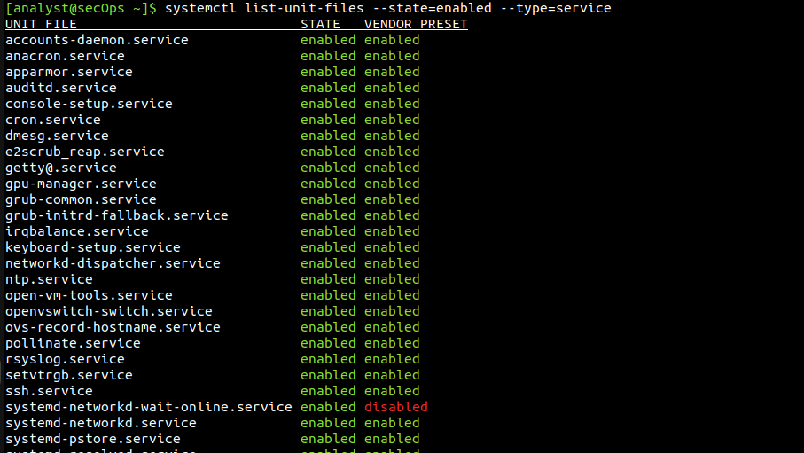
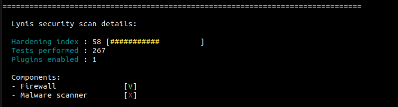
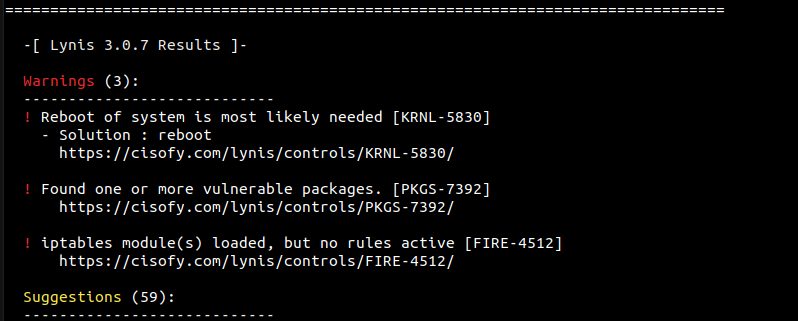
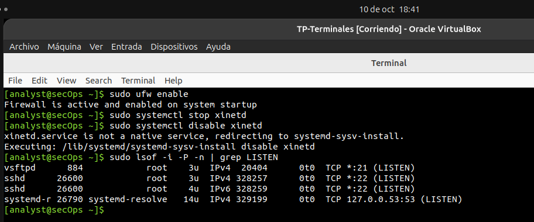
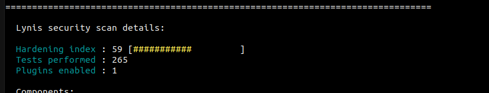
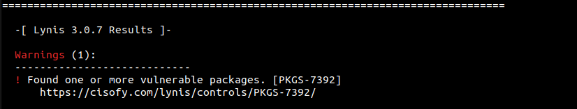

# Protección de Terminales

### Análisis de seguridad de hosts Linux con Lynis, OpenVAS y una distribución orientada a seguridad.
---

Para el desarrollo de la primera parte del laboratorio, se utilizó como sistema objetivo la máquina virtual `Cybersecurity Lab VM`.

Antes de hacer con la auditoría con Lynis, se ejecutaron los **Comandos Ubuntu** del enunciado.
---

### Identificación & Sockets

```bash
# 1. Verificar versión exacta del Kernel y OS
uname -r && lsb_release -a
```


> La VM usa **Ubuntu 22.04.1 LTS** con la versión de kernel **5.15**.

```bash
# 2. Auditar sockets TCP/UDP en escucha con PID/Proceso
sudo ss -tulpn
sudo netstat -l -p
```


```bash
# 3. Listar archivos y sockets abiertos por red
sudo lsof -i -P -n | grep LISTEN
```


> Hay servicios escuchando en la red, como  **Telnet (puerto 23)** y **FTP (puerto 21)**.

```bash
# 4. Servicios habilitados al inicio del sistema
systemctl list-unit-files --state=enabled --type=service
```


> La superficie de ataque puede reducirse, hay muchos servicios habilitados al inicio del sistema

```bash
# 5. Prueba de conexión manual
nc -zv 127.0.0.1 22
printf "GET / HTTP/1.1\r\nHost: www.google.com\r\nConnection: close\r\n\r\n" | nc www.google.com 80
```


> La conexión manual anda correctamente.

### Configuración UFW (Uncomplicated Firewall)

```bash
# Estado detallado de UFW
sudo ufw status verbose

# Configurar política por defecto
sudo ufw default deny incoming
sudo ufw default allow outgoing

# Permitir SSH restrictivo por IP/Subred
sudo ufw allow from 10.0.2.0/24 to any port 22 proto tcp

# Inspeccionar reglas traducidas en nftables
sudo nft list ruleset | head -n 20

```


>  El firewall figura inactivo, luego se escribieron reglas para denegar todo el tráfico entrante y permitir solo SSH desde una IP específica (primero verifico la subred que tengo con `ip address`). 

### Verificación HIDS & MAC 

> HIDS: Host-based Intrusion Detection System.

```bash
# 1. Estado de perfiles AppArmor
sudo aa-status
```


> AppArmor está activo y funcionando.

```bash
# 2. Reglas activas del subsistema de auditoría
sudo apt-get install auditd audispd-plugins
sudo auditctl -l

# 3. Inicializar / Verificar AIDE (File Integrity)
sudo aideinit && sudo aide --check

# 4. Estado del agente Wazuh (si está desplegado)
sudo systemctl status wazuh-agent
```


> El sistema no tiene reglas de auditoría cargadas, y tampoco tiene las herramientas de monitoreo AIDE y Wazuh.

---

## Lynis

Primero actualizo los paquetes del sistema e instalo Lynis:
```bash
sudo apt update
sudo apt install lynis
lynis --version
```

Ejecuto Lynis y guardo la salida para comparar después.
```bash
sudo lynis audit system
sudo cp /var/log/lynis-report.dat /var/log/lynis-report-before.dat
```


#### Resultado inicial

Se ejecutó auditoría con Lynis. La herramienta realizó 267 pruebas y obtuvo un índice hardenind de 58, identifico 3 advertencias y 59 sugerencias de mejora.





#### Detalles de las advertencias

Las advertencias indican la necesidad de reiniciar el sistema,
que hay actualizaciones de seguridad pendientes y que las reglas del firewall estan cargadas pero no activas.

Dentro de los servicios de red habilitado que no son necesarios encontro a Telnet y FTP que ya nos figuraban en la lista de sockets abiertos por red.

#### ¿Por qué representan un riesgo?

Al no tener el firewall activo la superficie de ataque queda totalmente expuesta, permitiendo que cualquier puerto abierto en el host sea accesible sin restricciones desde la red.
Telnet es un protocolo que no utiliza cifrado (por lo tanto es inseguro), esto puede permitir ataques de tipo *Man-in-the-Middle* (MitM) o captura de tráfico (*sniffing*).


#### Reparación

Para mitigar las advertencia voy a habilitar UFW, cerrar el puerto Telnet y rebootear el sistema.

```bash
# Habilitar el firewall UFW
sudo ufw enable

# Deshabilitar el servicio Telnet (xinetd)
sudo systemctl stop xinetd
sudo systemctl disable xinetd
# Compruebo que no figure el puerto 23
sudo lsof -i -P -n | grep LISTEN

# Reboot
sudo reboot
```



Luego del reboot ejecuto de vuelta la auditoria de lynis y comparo los reportes.





Se redujeron las advertencias y el indice hardening subio un punto.

> ¿La corrección tuvo algún impacto sobre la disponibilidad o funcionalidad del host?
No, la corrección no generó ningún impacto negativo sobre la disponibilidad ni sobre la funcionalidad del host.
---


#### 4. ¿Cómo la repararon?
La remediación se ejecutó en dos pasos controlados desde la terminal:
1. **Activación de UFW:** Se habilitó el firewall mediante `sudo ufw enable`, aplicando las políticas de denegar tráfico entrante por defecto y permitir únicamente el acceso SSH (puerto 22) desde la subred autorizada `10.1.0.0/24`.
2. **Cierre de Telnet:** Se detuvo y deshabilitó el servicio `xinetd` mediante `sudo systemctl stop xinetd` y `sudo systemctl disable xinetd` para cerrar el puerto 23/TCP.

#### 5. ¿Qué precauciones tomaron antes de modificar el sistema?
* **Creación de Línea de Base:** Se realizó una copia de respaldo del reporte de Lynis inicial (`sudo cp /var/log/lynis-report.dat /var/log/lynis-report-before.dat`).
* **Verificación de Reglas SSH:** Antes de activar UFW, se confirmó la existencia de la regla explícita para el servicio SSH (`sudo ufw allow from 10.1.0.0/24 to any port 22 proto tcp`) para evitar perder la conexión de administración remota.
* **Aislamiento en VM:** Todas las pruebas se llevaron a cabo dentro de un entorno virtualizado sin afectar sistemas de producción.

#### 6. ¿Qué cambió en el reporte posterior?
* **Eliminación de la Advertencia:** La alerta `! iptables module(s) loaded, but no rules active [FIRE-4512]` desapareció del reporte final de Lynis.
* **Incremento del Hardening Index:** El índice global de fortalecimiento aumentó reflejando la adición de controles activos.
* **Reducción de Superficie de Ataque:** La inspección mediante `sudo ss -tulpn` confirmó que el puerto 23 (Telnet/xinetd) dejó de figurar en escucha y `sudo ufw status verbose` pasó a estado `active`.

#### 7. ¿La corrección tuvo algún impacto sobre la disponibilidad o funcionalidad del host?
No hubo ningún impacto negativo sobre la disponibilidad. Se verificó que el servicio SSH continuó funcionando correctamente para la subred autorizada y la máquina virtual mantuvo conectividad a Internet y resolución DNS para sus tareas habituales.


¿Qué cambió en el reporte posterior?
¿La corrección tuvo algún impacto sobre la disponibilidad o funcionalidad del host?
No, la corrección no generó ningún impacto negativo sobre la disponibilidad ni sobre la funcionalidad del host.