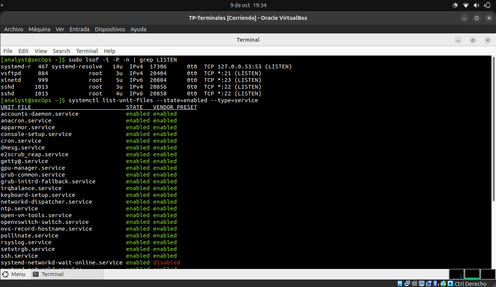
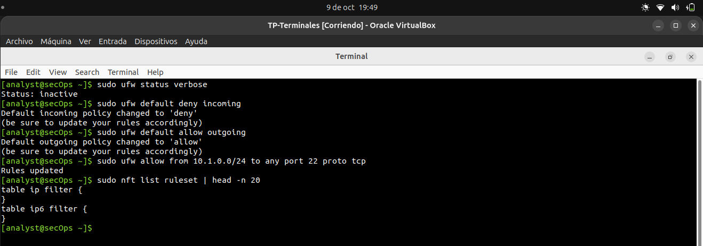
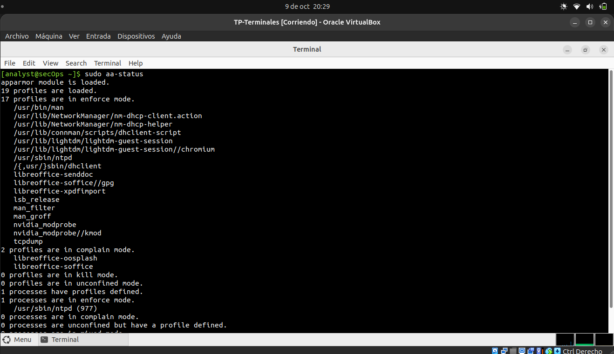

# Protección de Terminales

### Análisis de seguridad de hosts Linux con Lynis, OpenVAS y una distribución orientada a seguridad.
---

Para el desarrollo de la primera parte del laboratorio, se utilizó como sistema objetivo la máquina virtual `Cybersecurity Lab VM`.

Antes de hacer con la auditoría con Lynis, se ejecutaron los **Comandos Ubuntu** del enunciado.
---

### Identificación & Sockets

```bash
# 1. Verificar versión exacta del Kernel y OS
uname -r && lsb_release -a

# 2. Auditar sockets TCP/UDP en escucha con PID/Proceso
sudo ss -tulpn
sudo netstat -I
```


```bash
# 3. Listar archivos y sockets abiertos por red
sudo lsof -i -P -n | grep LISTEN

# 4. Servicios habilitados al inicio del sistema
systemctl list-unit-files --state=enabled --type=service
```


```bash
# 5. Prueba de conexión manual
nc -zv 127.0.0.1 22
printf "GET / HTTP/1.1\r\nHost: www.google.com\r\nConnection: close\r\n\r\n" | nc www.google.com 80
```


### Configuración UFW (Uncomplicated Firewall)

```bash
# Estado detallado de UFW
sudo ufw status verbose

# Configurar política por defecto
sudo ufw default deny incoming
sudo ufw default allow outgoing

# Permitir SSH restrictivo por IP/Subred
sudo ufw allow from 10.1.0.0/24 to any port 22 proto tcp

# Inspeccionar reglas traducidas en nftables
sudo nft list ruleset | head -n 20
```



### Verificación HIDS & MAC


```bash
# 1. Estado de perfiles AppArmor
sudo aa-status
```



```bash
# 2. Reglas activas del subsistema de auditoría
apt-get install auditd audispd-plugins
sudo auditctl -l

# 3. Inicializar / Verificar AIDE (File Integrity)
sudo aideinit && sudo aide --check

# 4. Estado del agente Wazuh (si está desplegado)
sudo systemctl status wazuh-agent
```


--------------

"En la auditoría inicial de los mecanismos HIDS y de integridad del host objetivo, se constató que el Kernel cuenta con el subsistema auditd activo pero sin reglas configuradas, mientras que herramientas como AIDE y wazuh-agent no están presentes en la instalación base del sistema. Esto confirma que la postura de seguridad interna depende actualmente de la configuración del firewall (UFW) y de las políticas del sistema operativo que serán evaluadas mediante Lynis."