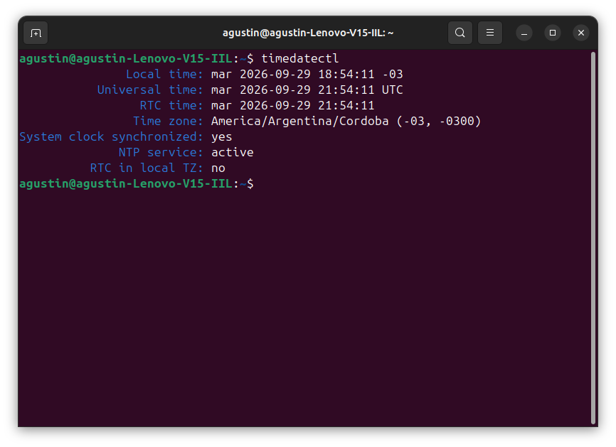
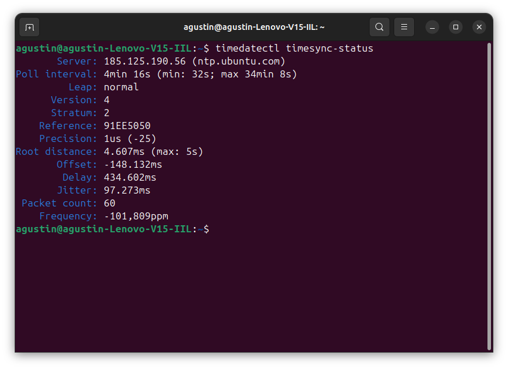
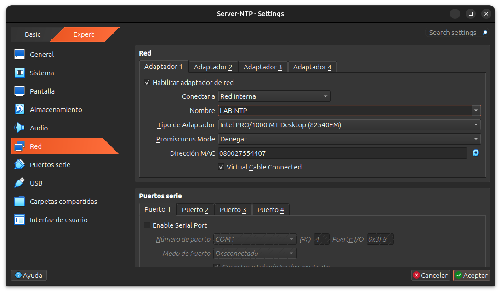
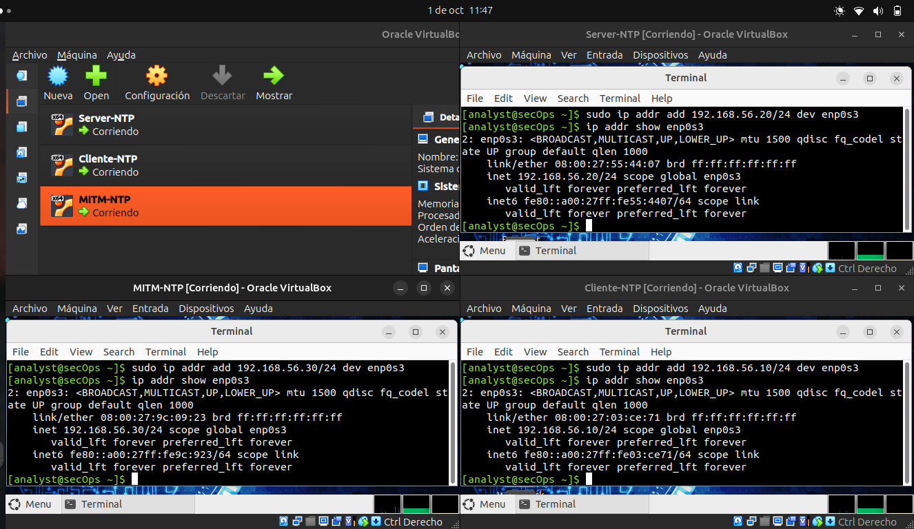
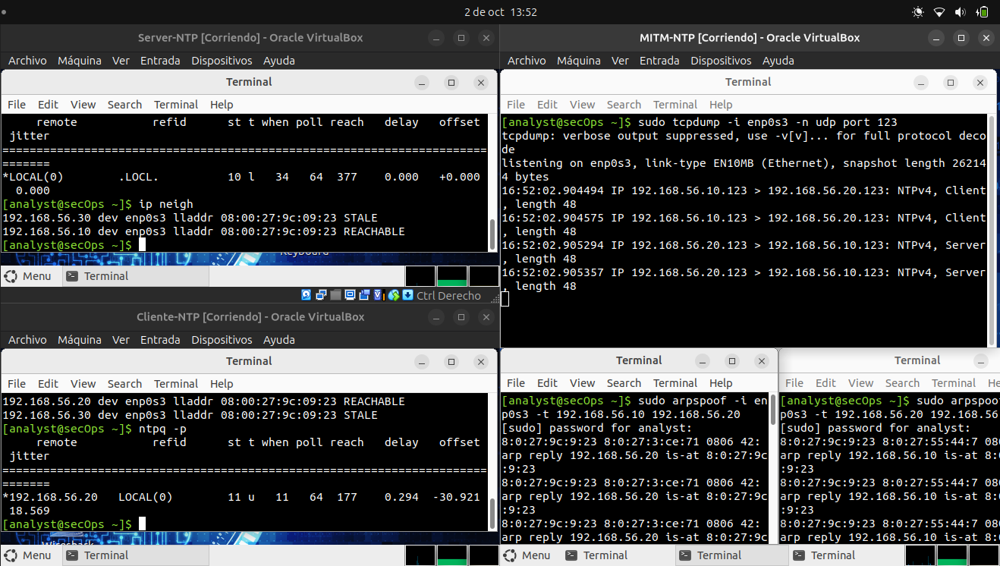
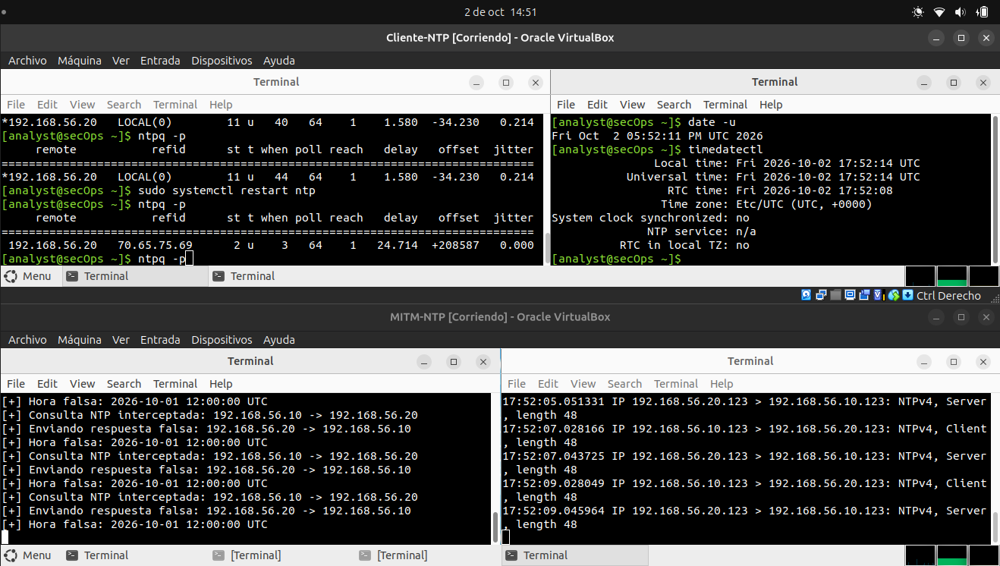

# NTP

### Primero: que es NTP y NTPsec? 
NTP (Network Time Protocol) es un protocolo de red utilizado para sincronizar la fecha y hora de los dispositivos a través de una red, como Internet o una red local.
También el protocolo tiene mecanismos para estimar el retardo de la red y calcular qué tan desfasado está el reloj local respecto del servidor.

NTPsec es una implementación de NTP, enfocada principalmente en mejorar la seguridad, robustez y mantenibilidad del protocolo.

### Vulnerabilidades e Implicancias

- **¿Cuáles son las vulnerabilidades de NTP?**

Las principales vulnerabilidades de NTP están relacionadas con la falta de autenticación ,lo que permite ataques como **spoofing, Man-in-the-Middle (MITM)**, donde un atacante puede interceptar o falsificar respuestas y hacer que un equipo ajuste su reloj a una hora incorrecta.

> Aclaración: Spoofing es falsificar la identidad o el origen de una comunicación para engañar al receptor.

Ademas, un MITM no necesariamente tiene que modificar las respuesta, solamente con retrasar determinados paquetes puede provocar que NTP calcule mal el defasaje.

- **¿Qué implicancias podría tener que se exploten esas vulnerabilidades?**

La alteración de la hora puede afectar logs, auditorías, certificados, mecanismos de autenticación y sistemas distribuidos, generando problemas de seguridad y dificultando el análisis de incidentes. 

- **¿Cuál es tu configuración de NTP actual?**

Para ver eso ejecuto `timedatectl`.



Figura si el protocolo está activo y la zona horaria que uso.

Tambien se puede ver el servidor que estoy usando, con su IP ejecutando `timedatectl timesync-status`



Ademas, figuran la version del protocolo, el defasaje y retardo que tengo.

### Ataque Man-in-the-Middle (MitM)
- **¿Puedes realizar un ataque de tipo Man-in-the-Middle (MitM) sobre un servicio NTP? ¿Puedes implementarlo?**

Si, pude implementarlo usando 3 máquinas virtuales en VirtualBox, donde una maquina es el server, otra el cliente y otra el MITM.
Se generó una red interna entre las tres y se configuró una dirección IP para cada una:





Quedando:

| Máquina     | Dirección IP    | 
| ----------- | --------------- |
| Cliente-NTP | `192.168.56.10` |
| Server-NTP  | `192.168.56.20` | 
| MITM-NTP    | `192.168.56.30` |

Y todo en una red interna `NTP-LAB`.

En `Server-NTP` hay que modificar `/etc/ntp.conf` para utilizar el propio reloj del servidor como referencia, y permitir el acceso desde `NTP-LAB`, para que `Cliente-NTP` lo pueda usar como servidor NTP.

Se reinicia el servicio ntp y verifico que el puerto UDP 123 esté escuchando
```bash
sudo systemctl restart ntp
sudo ss -lunp | grep ':123'
```

Desde el `Cliente-NTP` se configura `/etc/ntp.conf` para que lo use el reloj del server y se reinicia el servicio NTP.
Para comprobar la sincronización se ejecuta `ntpq -p` y en la sección de `remote` debe estar apuntando al IP del server.


Ahora la idea es que `MITM-NTP` haga de intermediario.
Lo primero que intente fue reenviar paquetes sin modificar nada, para eso habilitó el reenvío de paquetes IPv4 (es como hacer andar a la máquina virtual como un router), configurando el `ip_forward` en 1, e instale una herramienta `ARP spoofing` para poder interceptar los paquetes entre el server y el cliente.
Para instalarla tuve que agregar un segundo adaptador NAT a la máquina `MITM-NTP`, porque la red `NTP-LAB` estaba aislada y no tenía acceso a Internet.

```bash
sudo sysctl -w net.ipv4.ip_forward=1
sudo apt install dsniff #ARP spoofing
```
Para interceptar los paquetes hay que usar dos instancias de arpspoof, en dos terminales.

Terminal 1:
```bash
sudo arpspoof -i enp0s3 -t 192.168.56.10 192.168.56.20
```
Asocia la dirección de `Cliente-NTP` con la MAC de `MITM-NTP`

Terminal 2:
```bash
sudo arpspoof -i enp0s3 -t 192.168.56.20 192.168.56.10
```
Asocia la dirección de `Server-NTP` con la MAC de `MITM-NTP`

> Aclaración: `enp0s3` es el nombre de una interfaz de red en Linux.

Para observar el tráfico NTP desde se utilizó:
```bash
sudo tcpdump -i enp0s3 -n udp port 123
```



> En `Cliente-NTP` se ejecutó `ntpq -p`, y se observa que en `MITM-NTP` está la consulta a `Server-NTP` y respuesta.
> ```text
> 16:52:02.904575 IP 192.168.56.10.123 > 192.168.56.20.123: NTPv4, Client, length 48
> 16:52:02.905294 IP 192.168.56.20.123 > 192.168.56.10.123: NTPv4, Server, length 48
>```

Ahora para simular el ataque, hago que a `Server-NTP` no le lleguen las consultas, en `MITM-NTP` pongo en 0 a `ip_forward`.

```bash
sudo sysctl -w net.ipv4.ip_forward=0
```

Genero un script en python para que de respuestas NTP falsificadas.

Esto provoca que `MITM-NTP` de repuesta como si fuese `Server-NTP`.



La parte de abajo está `MITM-NTP` ejecutando el script de python y capturando el trafico, y arriba esta `Cliente-NTP` ejecuntando `ntpq -p`.
Se logra ver que el offset calculado por ntp es de -34 ms, y cuando reinicio el servicio con `sudo systemctl restart ntp` y ejecuto de vuelta `ntpq -p` ya toma la respuesta falsa de `MITM-NTP`, con un offset de +208587 ms.
Al ejecutar `timedatectl` figura que el reloj está desincronizado, pero no logro modificar efectivamente la hora.

### Evitar Problemas y Verificación
- **¿Cómo configurarías tu host para evitar problemas con NTP?**

Usar un único servicio de sincronización (si se usa más de uno podría haber problemas entre ellos) y que es ese servicio utilice varias fuentes NTP confiables.
Y para evitar problemas de seguridad, conviene utilizar NTS (Network Time Security), que permite proteger la comunicación NTP frente a ataques como spoofing y MITM mediante mecanismos de autenticación criptográfica.

- **¿Cómo verificas que la configuración es correcta?**

Comprobando el estado del servicio este activo y sincronizado:
```bash
timedatectl
```
Y verificando que se este usando un servicio:
```bash
ntpq -p
```
Debe aparecer con un asterisco (*) en `remote`.

### INTI
- **¿Conoces `ntp.inti.gob.ar`? ¿Es seguro?**

No, no lo conocia.
Buscando veo que es el servidor oficial de hora para Argentina.
En términos de exactitud es confible, genera la hora a partir de los relojes atómicos y es la referencia oficial de la hora legal argentina (UTC-3).
Pero no es seguro, ya que no soporta NTS. Si se utiliza en una red no confiable como un Wi-Fi publico se puede interceptar y alterar los paquetes de hora.
