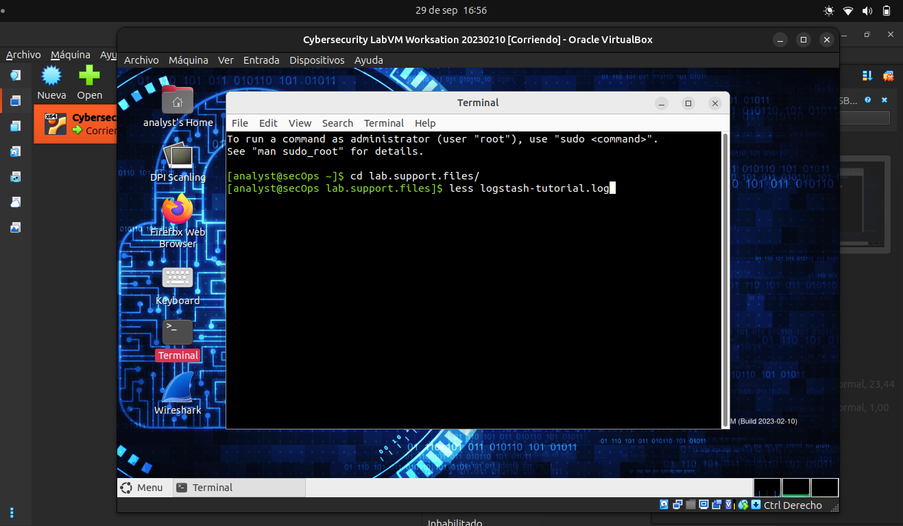
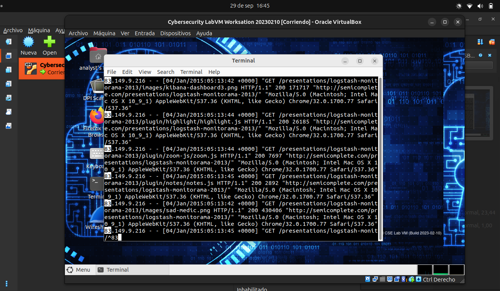
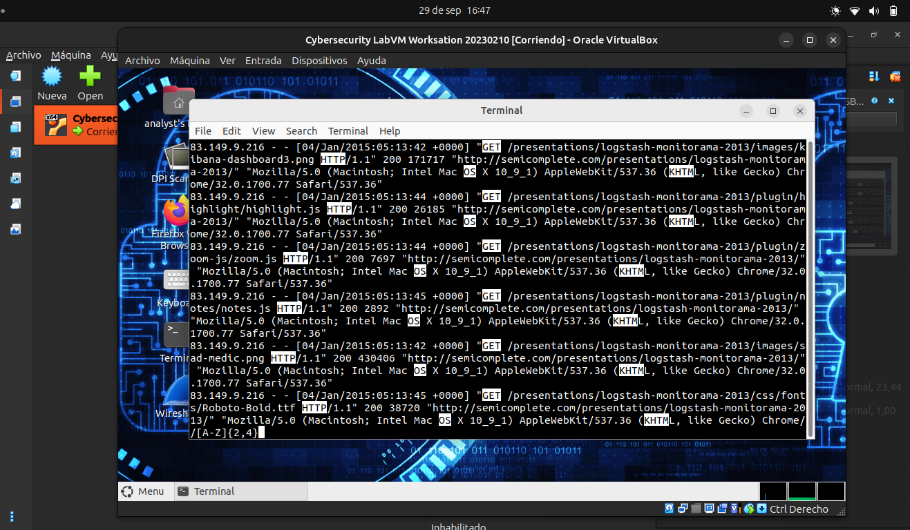
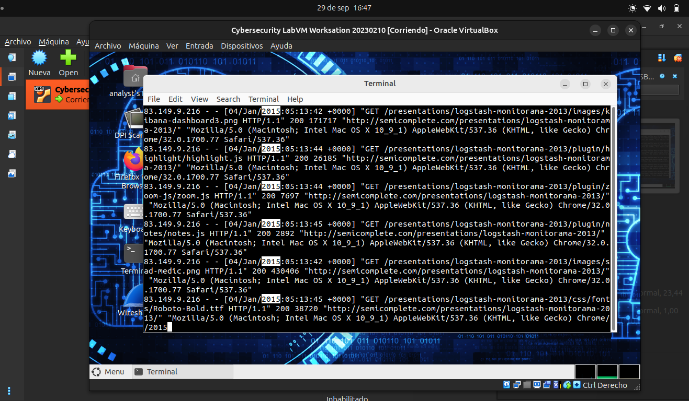
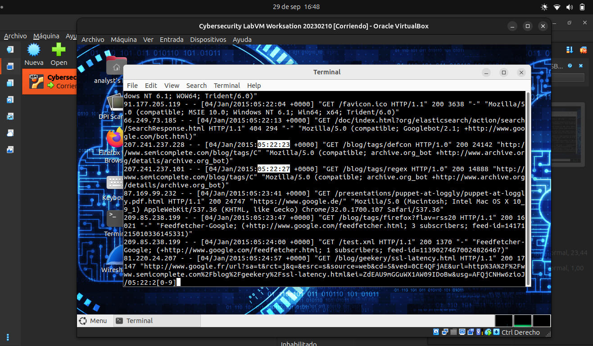
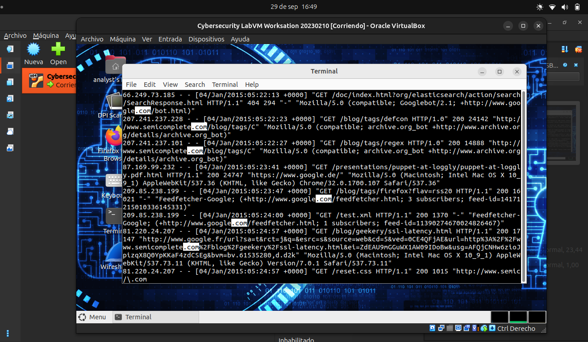
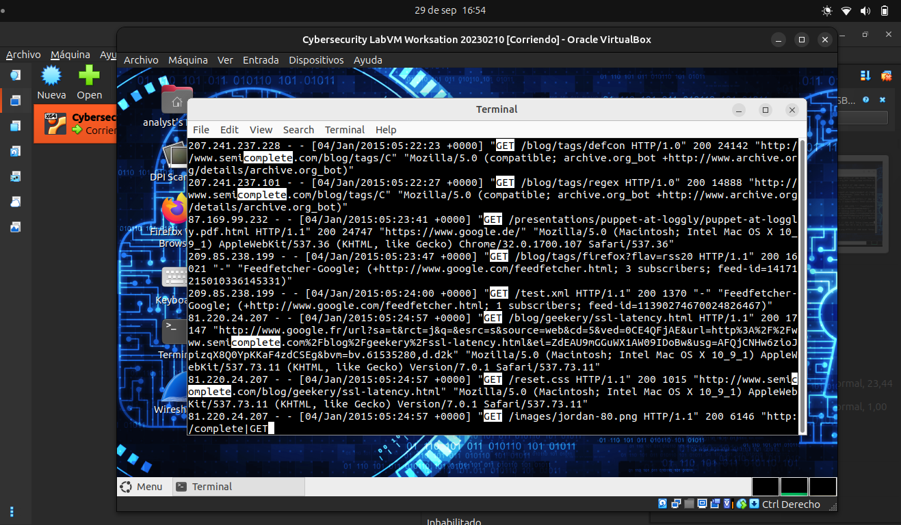
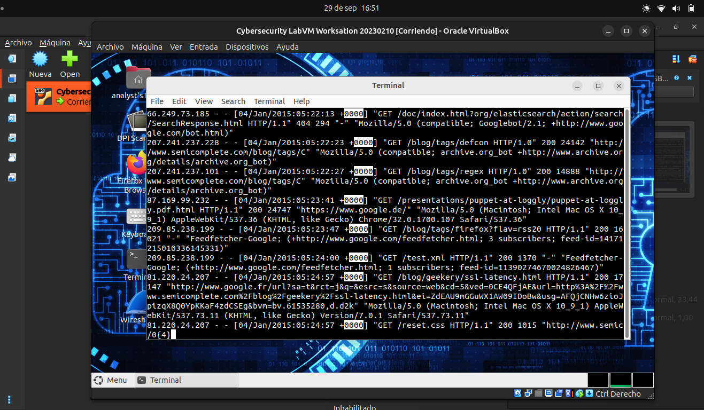

# Expresiones Regulares

#### Paso 1

a) Hacer el tutorial de regexOne: 

b) Describir la función de los metacaracteres:

| Metacaracteres | Descripción |
| :--- | :--- |
| `$` | Indica el final de una cadena. |
| `*` | Indica que el elemento anterior puede aparecer cero o más veces. |
| `[]` | Define un conjunto de caracteres. |
| `.` | Es como un comodin ,coincide con cualquier carácter. |
| `\d` | Coincide con cualquier dígito numérico, de `[0-9]`.|
| `\D` | Coincide con cualquier carácter que no sea un dígito|
| `^` | Indica el inicio de una cadena.|
| `{m}` | Indica que el elemento anterior debe aparecer `m` veces. |
| `{n,m}` | Indica que el elemento anterior debe aparecer entre `n` y `m` veces, inclusive. |
| `abc\|123` | El operador `\|` significa una OR: coincide con `abc` o con `123`. |

#### Paso 2

Describir el patrón de expresión regular proporcionado:

| Patrón de expresión regular | Descripción |
| :--- | :--- |
| `^83` | La cadena debe iniciar con un `83`. |
| `[A-Z]{2,4}` | Indica que debe haber entre 2 y 4 letras mayúsculas. |
| `2015` | Debe coincidir con la cadena `2015`. |
| `05:22:2[0-9]` | Debe coincidir con la cadena `05:22:2` y cualquier otro número del 0 al 9. |
| `\.com` | Debe coincidir con `.com`, la barra `\` hace literal al punto `.` .|
| `complete\|GET` | La cadena debe ser `complete` o `GET`. |
| `0{4}` | La cadena debe ser de 4 veces `0`. |

#### Paso 3: Verificar las respuestas del paso 2

Ingreso VM:

`^83` :

`[A-Z]{2,4}`:

`2015`:

`05:22:2[0-9]`:

`\.com`:

`complete|GET`:

`0{4}`:

Todas las expresiones andan como corresponde.
